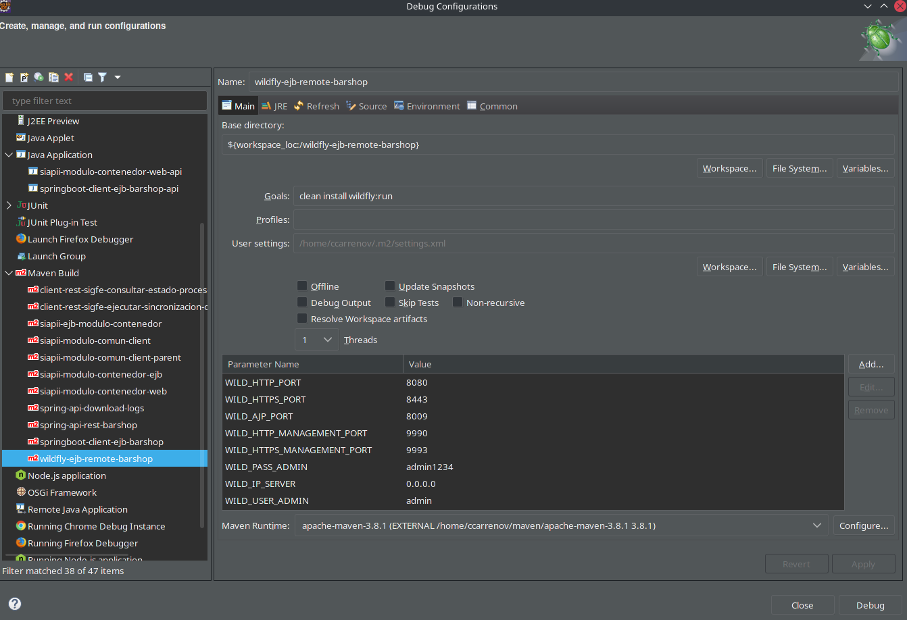
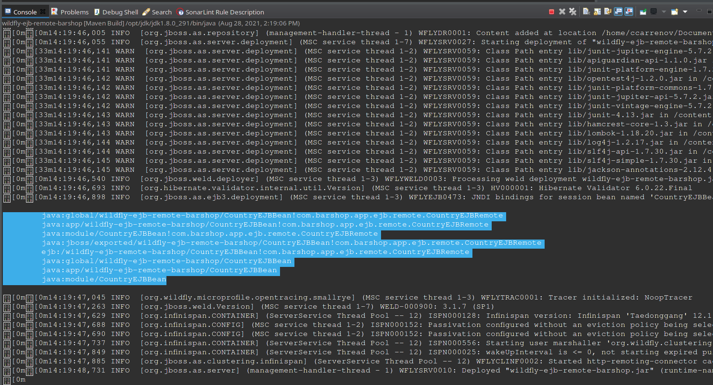
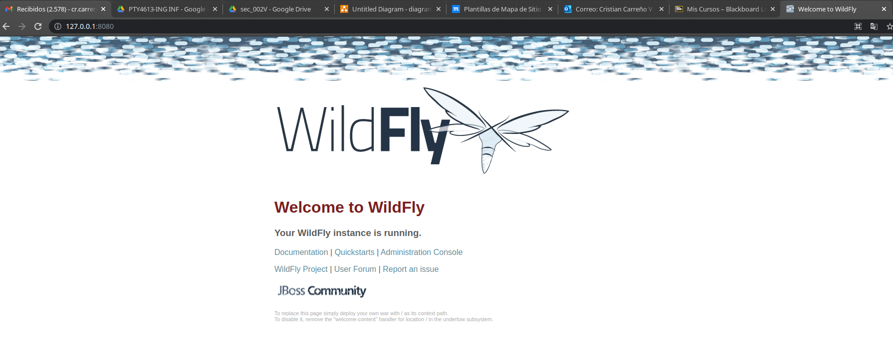
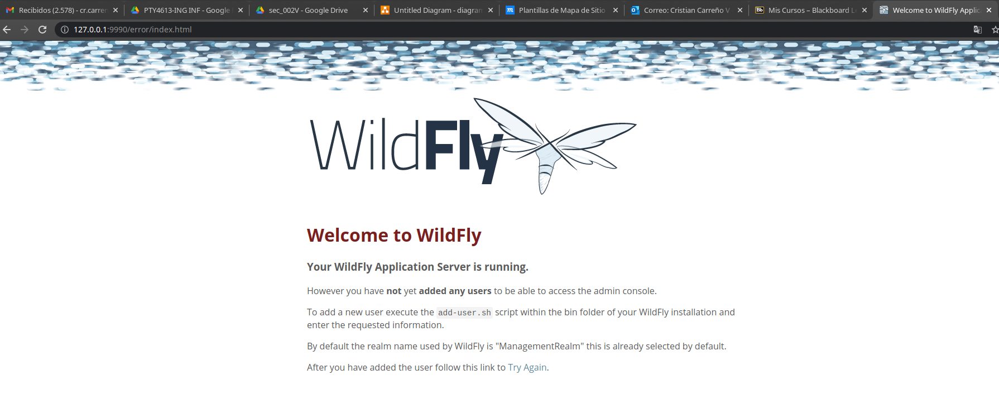

# wildfly-ejb-remote-barshop
Project ejb wildfly BarShop.

## ENVIRONMENT ECLIPSE WILDFLY CONFIGURATION

WILD_IP_SERVER = 0.0.0.0

WILD_HTTP_PORT = 8080

WILD_HTTPS_PORT = 8443

WILD_AJP_PORT = 8009

WILD_HTTP_MANAGEMENT_PORT = 9990

WILD_HTTPS_MANAGEMENT_PORT = 9993

WILD_USER_ADMIN = admin

WILD_PASS_ADMIN = admin1234dd

## COMMAND MVN

### COMPILE AND DEPLOY

clean install wildfly:run

## WILDLY

http://127.0.0.1:8080/

http://127.0.0.1:9990/

mvn install:install-file \
   -Dfile=target/wildfly-24.0.1.Final/standalone/deployments/wildfly-ejb-remote-barshop.jar \
   -DgroupId=com.barshop.app.ejb \
   -DartifactId=wildfly-ejb-remote-barshop \
   -Dversion=1.0.0-SNAPSHOT \
   -Dpackaging=jar \
   -DgeneratePom=true

mvn install:install-file \
   -Dfile=target/wildfly-ejb-remote-barshop.jar \
   -DgroupId=com.barshop.app.ejb \
   -DartifactId=wildfly-ejb-remote-barshop \
   -Dversion=1.0.0-SNAPSHOT \
   -Dpackaging=jar \
   -DgeneratePom=true
